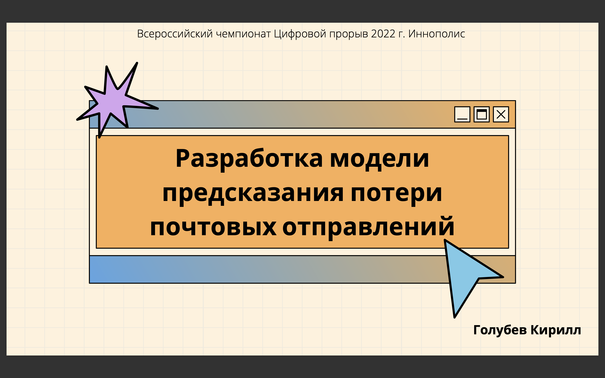
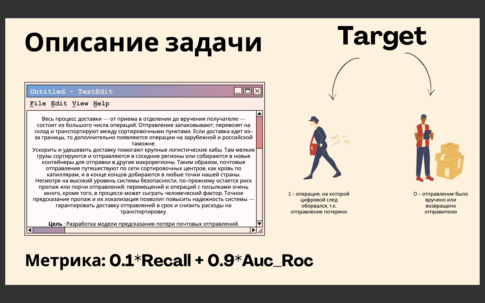
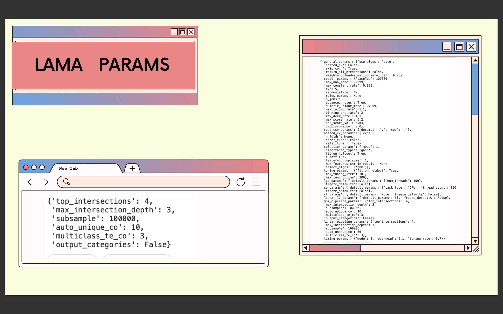
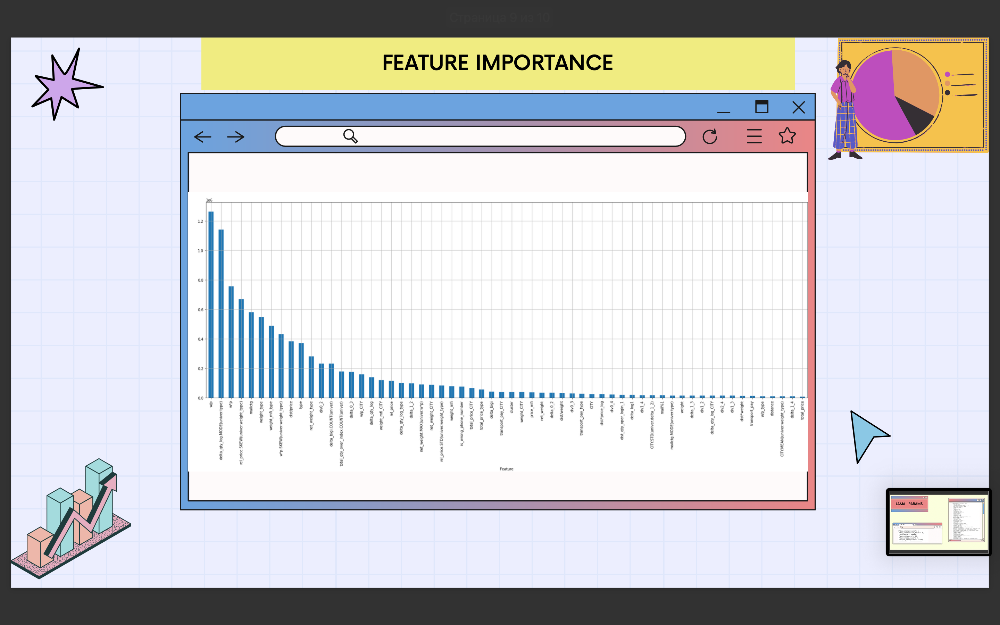
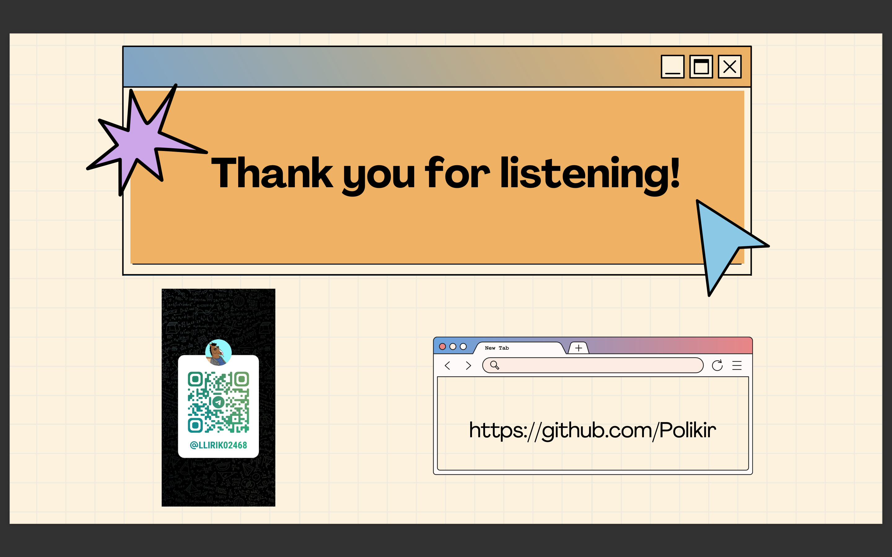

# Pochta_Vseross_Comp

Привет Всем. Это мой репозиторий к соревнованию: https://hacks-ai.ru/championships/758467

Обученная Модель находится по ссылке: https://drive.google.com/file/d/1VuQ8JPz1BT2xbnt3Qx_5oHh06VTIvC8w/view?usp=sharing

### Ниже, вы можете скачать все нужны для обучения данные, среди них промежуточные сгенерированные наборы данных для обучения, а так же вспомогательные к ним

train_dataset_train.csv - https://drive.google.com/file/d/1OlTO6x-VTUehhc-5VU1gD9F6Du-XI11D/view?usp=sharing

test_dataset_test.csv - https://drive.google.com/file/d/1_3NilkGJOx2vCoYhbmLG-o8R8aRJWPmk/view?usp=sharing

all_big.csv - https://drive.google.com/file/d/1zJeYlt2euRSJi_C25BGyu5LmO1pxPwJt/view?usp=sharing

big_df.csv - https://drive.google.com/file/d/1luhGPR0zWXCmVAsa5tA74e5z9FE63y3F/view?usp=sharing

label.csv - https://drive.google.com/file/d/1nUNXbmncyEaimwlhOXpIlhsh8f-MLoEd/view?usp=sharing

PIndx20.csv - https://drive.google.com/file/d/1mM1Jt3HcwfEx6lVsqbwHiVFQJuW28WV6/view?usp=sharing

train_clusters.csv - https://drive.google.com/file/d/1IwFMbWJNUU1G-UkbjpOAq8jAYpCZrLfM/view?usp=sharing

test_clusters.csv - https://drive.google.com/file/d/14mCgEKtF_Z-p6qLkvs-ovM1WtilHy_N-/view?usp=sharing

Folder with vect{i} - https://drive.google.com/drive/folders/13Jeb0ZrCpArPSkdRomBEb_ja9cjVSvPN?usp=sharing

Folder with t_vect{I} - https://drive.google.com/drive/folders/1T9kLkZ6yPWElSj5sIpzthhHsMDLlpVwk?usp=sharing

didi.csv - https://drive.google.com/uc?id=1T3AIuQP60POzUj1ZJ8VcEdrXz0FSFAEA

new_gener_1.csv - https://drive.google.com/uc?id=1_hvzMNtlecoqe3HDjR4tJBeHiMIyN0Hy

new_gener_2.csv - https://drive.google.com/uc?id=1u7D4e0Y8q74dRZQchPWEP7DpyTSeWFwB

new_gener_3.csv - https://drive.google.com/uc?id=1bDd1q99DCyzSE7bk5sjf7NSTPrWc3nwH

new_gener_4.csv - https://drive.google.com/uc?id=1ddQBeAAvipVtPf4r3AxBuGNpBi17Fa7o

new_gener_5.csv - https://drive.google.com/uc?id=1p8khccYNHWREjKO47R0OMmTA7TyZfiEn

new_gener_6.csv - https://drive.google.com/uc?id=1GqWeW4Z4nAVrJsIxaw_M1qy5tV4mQcTO

# Презентация

